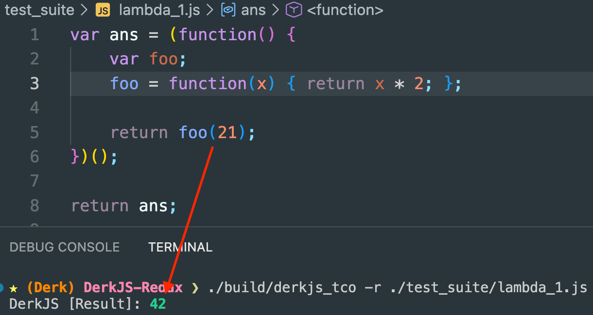
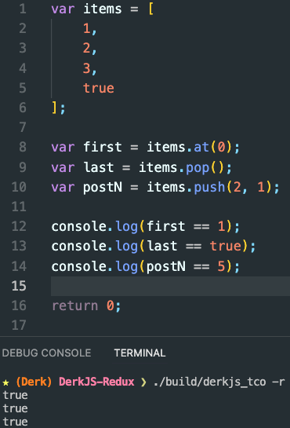

## README

### Brief
My latest attempt at implmenting JavaScript under version ES5 in modern C++.

### Dependencies
 - LLVM 21.1.7+ (just the Homebrew distribution for now)
 - CMake 4.2+
 - Ninja

### Caveats
 - `use strict` is the locked default.
 - No automatic semicolon insertion.

#### Demo: Function Expressions

#### Demo: Array methods

### Usage
 1. Give `./utility.sh` run permissions.
 2. Run `./utility.sh help` to see info on building, sloc count, etc.
 3. Run `./build/derkjs_tco -h` for help if you've successfully built the TCO intepreter version.

### Other Repo Docs:
 - [Roadmap](../docs/roadmap.md)
 - [Subset Grammar](../docs/grammar.md)
 - [Objects](../docs/objects.md)
 - [OLD Semantic Checking](../docs/sema_checks.md)
